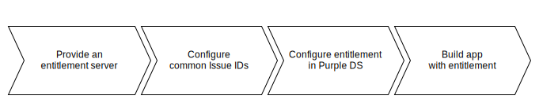

#############################
Entitlement server connection
#############################

.. toctree::
        :maxdepth: 1
        :hidden:

        entitlement_types/standard_v1
        entitlement_types/standard_v2
        entitlement_types/dps_v1

Overview
########

Entitlement allows content to be shown to authorized users of apps and web newsstands only.
Purple DS can utilize entitlement to verify app and newsstand requests with an external entitlement server.

  Quick overview: How Purple DS utilizes external entitlement servers.

Workflow
########

To achieve this, an entitlement server must be provided and some configuration must be carried out in Purple DS | Manager.

  4 simple steps to implement entitlement

Provide an entitlement server
=============================

On client side, an entitlement server must be provided. Purple DS may connect to several types of entitlement servers,
including but not limited to the following:

- :doc:`entitlement_types/standard_v1` A very simple entitlement server definition.
- :doc:`entitlement_types/standard_v2` An enhancement of the previous to have more control.
- :doc:`entitlement_types/dps_v1` Connect to entitlement servers following the Adobe DPS Entitlement standard, used by several publishers.

Issue configuration
===================

Hide issues
-----------

By default, all issues can be read by all users of an app or web newsstand. This is usually not desired when an entitlement server is used.
There are two stages of privacy to achieve.

1. An issue can be marked as "Paid content" in Purple DS | Manager. In this case, the issues thumbnail and title are visible
   for the unauthorized user, as well as some preview content, but the user must log in to the entitlement server in order to read the full content.

.. note:: There may be other options to unlock such content, e.g. app store payment or coupon redemption, depending on the configuration.

2. An issue can be marked as "Content protected via Entitlement" in Purple DS | Manager.
   In this case, the issue is not to be seen for unauthorized users.

Common issue identifiers
------------------------

The entitlement server provides information about entitled issue IDs for the logged in user.
This obviously requires a common understanding of the entitlement server and Purple DS about the meaning of the exchanged issue IDs.

There are three possible implementations to achieve this:

1. The most common way is to configure the clients issue ID at the appropriate issue in the Purple DS | Manager.
   Purple DS | Delivery detects issues, where any of the delivered issue IDs is configured, and allows access.

.. note:: It is possible to configure the same client issue ID at multiple issues in the Purple DS | Manager
   to allow access to multiple issues at once.

2. The other way round, Purple DS issue IDs can be configured at the client side, and the clients entitlement server delivers them.
   Purple DS | Delivery recognizes it's own issue IDs and allows access to the issues.
3. For some use cases it is sufficient, to allow access to all app content. In this case, the clients entitlement server
   delivers a single pseudo issue ID, which Purple DS | Delivery interprets as "allow access to all issues".

Entitlement server configuration
================================

To use entitlement to unlock app content, the clients entitlement server must be configured in Purple DS | Manager.
There is a special tab in the apps's tab bar for the entitlement settings.
Add a server, configure the URL and optionally the cache duration (depending of the entitlement server type) and save the configured server.

App configuration
-----------------

Entitlement must be switched on for the app. Several additional parameters can be set, like force login at app start and others.
This is done at the same tab as the server configuration. After this, the app can be built as usual.

Web newsstand configuration
---------------------------

To use entitlement in a web newsstand, it is to be configured in the basic settings of the app, provided a web newsstand is configured at all.
This setting can be changed at any time.

