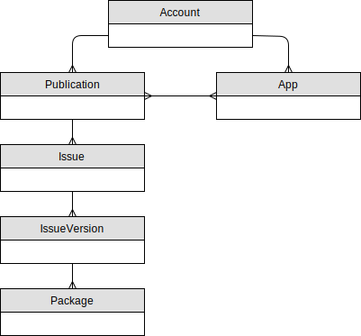
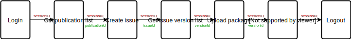

#############################
Manager public REST interface
#############################

Before starting with specific APIs we give an overview of the basic data model and the complete workflow from login to upload of packages.

Data model
##########

  Publication and issue data model

Workflow
########

At first you have to `Login`_ to the Purple DS | Manager. That generates a :code:`sessionID` used for all other API calls.

The second step is to retrieve an ID of a publication for which an issue will be edited.
Therefore a `Publication list`_ containing all publications visible to the logged in user may be requested.
From the result the publication name may be used to identify a specific publication.

Using the publication ID, either a new issue is created by `Create issue`_
or the list of all issues of that publication is requested by `Issue list`_.
Again the issue name may be used to identify a specific issue and the ID is used for further operations.

Now in a similar way an issue version is created by `Create issue version`_
or requested from the list of versions of this issue to be retrieved by `Issue version list`_.

.. hint:: As a matter of fact when creating an issue, a first issue version is created automatically.
    Therefore, the latter is most probably what you would do.

Using the version ID, new packages for this issue version can be uploaded. The packages contain the actual issue data.
A package is uploaded to an issue version by `Upload package`_ and then
the issue version is published by `Change issue version status`_.

Don't forget to `Logout`_ to invalidate the :code:`sessionID` when you are done.

The following picture shows the complete workflow needed for publishing a new issue for an existing publication
including the propagation of the necessary ID parameters from one request to another.

  Simple workflow to publish a new issue

For more sophisticated use cases, one can upload multiple packages to an issue version and
`Associate package with platforms or device classes`_.
In order to have all parameter values for these constraints, the global `Configuration`_ -
containing the lists of platforms and device types - has to be queried once.

Furthermore, additional assets like videos or music can be added by `Upload package`_,
preview or "coming soon" versions can be created and many more. All of this is laid out in detail in the following text.

API Description
###############

This chapter describes all APIs to fulfill the package management workflow explained before.

Basic requirements for all API calls
====================================

Base URL
--------

Base URL for all API calls is

================= ========================================================
Target            URL
================= ========================================================
Production system https://purplemanager.com/purple-manager-backend
Staging system    https://staging.purplemanager.com/purple-manager-backend
================= ========================================================

Security header
---------------

Each request to the backend must have a request header named :code:`xr` and an additional query parameter
(even if it’s a POST request) named :code:`xr`, both containing the same random number (integer).

Configuration
=============

For later usage during upload of packages the global configuration needs to be queried.
It returns all platforms and device classes which need to be passed using their identifiers.

[GET] /configuration

Request Parameters
------------------

none

Result
------

Result is a JSON object with the following relevant entries

============= ===== ========================================================================
Field         Type  Description
============= ===== ========================================================================
platforms     Array All known platforms as JSON objects containing an id and name field
deviceClasses Array All known device classes as JSON objects containing an id and name field
                    and an optional field "subclasses" containing sub-device classes.
============= ===== ========================================================================

----

Login
=====

After successful login a session token is returned, which is used for each subsequent API call.

[POST] /auth/login

Request Parameters
------------------

==============  ======  =================================================
Parameter name  Type    Description
==============  ======  =================================================
email           String  Email address of a valid Purple DS | Manager user
password        String  Password of a valid Purple DS | Manager user
==============  ======  =================================================

Result
------

Result is a JSON object from which only the property :code:`sessionID` is used for further API usage.

========= ====== ===========================================
Field     Type   Description
========= ====== ===========================================
sessionID String Session token used for subsequent API calls
========= ====== ===========================================

----

Logout
======

Logout invalidates the current session.

[POST] /auth/logout

Request Parameters
------------------

==============  ======  ===========================================
Parameter name  Type    Description
==============  ======  ===========================================
sessionID       String  Session token that is invalidated
==============  ======  ===========================================

Result
------

No result data.

----

Publication list
================

A publication list is associated with one or more accounts (teams) the logged in user is associated with. Using this list a publication may be selected by name (or other criteria).

[GET] /publication/list

Request Parameters
------------------

==============  ======  ========================================
Parameter name  Type    Description
==============  ======  ========================================
sessionID       String  Valid session token created by `Login`_.
==============  ======  ========================================

Result
------

The result is a JSON array containing all publications accessible for the logged in user.
Each publication is a JSON object containing the following relevant properties:

=====   ======  ============================================
Field   Type    Description
=====   ======  ============================================
id      String  Publication id used for subsequent API calls
name    String  Name of the publication
=====   ======  ============================================

----

Create issue
============

In case the issue for which the package shall be uploaded does not exist yet, it may be created using this API call.

[POST] /issue

Request Parameters
------------------

============== ====== =====================================================================
Parameter name Type   Description
============== ====== =====================================================================
sessionID      String Valid session token created by `Login`_.
publicationId  String Id of the publication returned by `Publication list`_.
id             String Set to :code:`-1`
name           String Name of the new issue.
description    String A description of the new issue (optional).
published      Date   Date of publication of the new issue (may be in the past or future).
                      Format: :code:`yyyy-MM-dd`
file           File   issue thumbnail file (jpg or png)
============== ====== =====================================================================

Result
------

ID of the new issue

----

Issue list
==========

Querying an issue list of a publication helps to select an issue by name.

[GET] /publication/listissues

Request Parameters
------------------

============== ====== ====================================================
Parameter name Type   Description
============== ====== ====================================================
sessionID      String Valid session token created by `Login`_.
publicationId  String Id of a publication returned by `Publication list`_.
============== ====== ====================================================

Result
------

The result is a JSON array containing all issue of the given publication.
Each issue is a JSON object with the following relevant properties:

===== ====== ======================================
Field Type   Description
===== ====== ======================================
id    String Issue id used for subsequent API calls
name  String Name of the issue
===== ====== ======================================

----

Change issue "coming soon" status
=================================

In order to change the issue "coming soon" status there are activating and deactivating API calls.
These calls are distinguished by their path.

================================ ===========================
Purpose                          Call
================================ ===========================
Activate "coming soon"           [POST] /issue/comingsoon
Deactivate "coming soon"         [POST] /issue/notcomingsoon
================================ ===========================

.. note:: Setting :code:`comingSoon` for an issue resets any versions :code:`active` status and vice versa.
          See `Change issue version status`_.

Request Parameters
------------------

=============== ======= ===============================================================================
Parameter name  Type    Description
=============== ======= ===============================================================================
sessionID       String  Valid session token created by `Login`_.
id              String  Id of an issue for which the status is to be changed. It may be
                        retrieved by a call to `Issue list`_ or by `Create issue`_.
=============== ======= ===============================================================================

Result
------

No result data.

----

Create issue version
====================

Shall a package be uploaded into a new version of an issue, it has to be created beforehand.
Every issue has a first version (number 1) created automatically when the issue is created.

Besides the "full version" of an issue there may be "customer preview versions" used to present part of an issue to the customer for free.
For these "customer preview versions" the first version has to be created by this API call explicitly.

[POST] /version

Request Parameters
------------------

=============== ======= ===================================================================================================
Parameter name  Type    Description
=============== ======= ===================================================================================================
sessionID       String  Valid session token created by `Login`_.
issueId         String  Id of an issue returned by `Issue list`_ or by `Create issue`_.
customerPreview boolean Optional, if true a new "customer preview version" is created, otherwise a full version is created.
=============== ======= ===================================================================================================

Result
------

The result is the id of the new issue version.

----

Issue version list
==================

Having the list of all versions of an issue, one may pick a version by its version number or the status (published, preview or "coming soon")
and use the id of this version in subsequent calls.

[GET] /issue/listversions

Request Parameters
------------------

=============== ======= ============================================================================================================
Parameter name  Type    Description
=============== ======= ============================================================================================================
sessionID       String  Valid session token created by `Login`_.
issueId         String  Id of an issue returned by `Issue list`_ or by `Create issue`_.
customerPreview boolean Optional, if true "customer preview versions" are returned, otherwise the list of full versions is returned.
=============== ======= ============================================================================================================

Result
------

The result is a JSON array containing all versions of the given issue. Each version is a JSON object with the following relevant properties:

========== ======= ==========================================================================================
Field      Type    Description
========== ======= ==========================================================================================
id         String  Version id that may be used in subsequent API calls
number     Integer Version number
active     Boolean Flag indicating whether this version is published in release app.
preview    Boolean Flag indicating whether this version is published in preview app.
========== ======= ==========================================================================================

----

Change issue version status
===========================

In order to change issue version status there are activating and deactivating API calls for each of the status flags:
:code:`active` (published to release and preview app) and :code:`preview` (published to preview app).
These calls are distinguished by their path.

.. note:: For backward compatibility reasons the issue status :code:`comingSoon` can be set through a version as well.

Boundary conditions
-------------------

1. In order to Change issue version status to be published into the release app, there needs to be a bundle uploaded,
   see `Upload package`_.
2. If a version is published to release or preview app, the same status of another version is automatically deleted,
   so there is always exactly one issue version published to release or preview app.
3. A version published to release app cannot be modified afterwards, a new version has to be created instead.
4. Setting :code:`comingSoon` for an issue resets any versions :code:`active` status and vice versa.

================================ ============================= ============================================
Purpose                          Call
================================ ============================= ============================================
Publish to release app           [POST] /version/activate
Unpublish from release app       [POST] /version/deactivate
Publish to preview app           [POST] /version/preview
Unpublish from preview app       [POST] /version/notpreview
Activate "coming soon"           [POST] /version/comingsoon    deprecated, use /issue/comingsoon instead
Deactivate "coming soon"         [POST] /version/notcomingsoon deprecated, use /issue/notcomingsoon instead
================================ ============================= ============================================

Request Parameters
------------------

=============== ======= ===============================================================================
Parameter name  Type    Description
=============== ======= ===============================================================================
sessionID       String  Valid session token created by `Login`_.
versionId       String  Id of an issue version for which the status is to be changed. It may be
                        retrieved by a call to `Issue version list`_ or by `Create issue version`_.
=============== ======= ===============================================================================

Result
------

No result data.

----

Upload package
==============

Using this call a Purple DS archive (.pkar) is uploaded to an issue version.
It may also be used to upload large asset files (e.g. videos) that are nor bundled into the Purple DS archive.

.. note:: The version must not been flagged as "published to a release app", a.k.a. :code:`active`.

[POST] /package/upload

Request Parameters
------------------

=============== ======= =================================================================================
Parameter name  Type    Description
=============== ======= =================================================================================
sessionID       String  Valid session token created by `Login`_.
versionId       String  Id of an issue version for which the status is to be changed. It may be retrieved
                        by a call to `Issue version list`_ or by `Create issue version`_.
file            File    File to be uploaded
=============== ======= =================================================================================

Result
------

Result is the id of the uploaded package.

----

Associate package with platforms or device classes
==================================================

After uploading a file it is not yet associated with a platform or device class. This has to be done by a subsequent API call.
If a packages is not associated with platforms and/or device classes it is valid for all platforms and/or device classes.

.. note:: The version must not been flagged as published to a release app.

[POST] /package/editRelations

Request Parameters
------------------

These parameters need to be passed within the URL:

=============== ======= =================================================================================
Parameter name  Type    Description
=============== ======= =================================================================================
sessionID       String  Valid session token created by `Login`_.
packageId       String  Id of a package uploaded beforehand using `Upload package`_.
=============== ======= =================================================================================

Body
----

For defining associations a request body containing a JSON object needs to be sent with the request. It has the following properties:

=============== ======= =================================================================================
Field           Type    Description
=============== ======= =================================================================================
t               String  Always :code:`par`
deviceClasses   Array   An array of JSON object containing the device classes.
platforms       Array   An array of JSON objects containing the platforms
tags            String  A comma separated string of tags, may be an empty string.
=============== ======= =================================================================================

Device classes object
+++++++++++++++++++++

Objects within the deviceClasses array containing the following properties:

=============== ======= =================================================================================================================
Field           Type    Description
=============== ======= =================================================================================================================
t               String  Must contain :code:`pdc`
deviceClassId   String  Id of the device class that shall be selected or unselected for the package.
                        Use the `Configuration`_ call to query available device classes once.
deviceClassName String  Name of the device class that shall be selected or unselected for the package.
                        Use the `Configuration`_ call to query available device classes once.
selected        Boolean Indicates the change to the device class association, i.e. selects or unselects the device class for the package.
=============== ======= =================================================================================================================

Platform object
+++++++++++++++

Objects within the platforms array containing the following properties:

=============== ======= =================================================================================================================
Field           Type    Description
=============== ======= =================================================================================================================
t               String  Must contain :code:`pap`
platformId      String  Id of the platform that shall be selected or unselected for the package.
                        Use the `Configuration`_ call to query available platforms once.
platformName    String  Name of the platform that shall be selected or unselected for the package.
                        Use the `Configuration`_ call to query available platforms once.
selected        Boolean Indicates the change to the platform association, i.e. selects or unselects the platform for the package.
=============== ======= =================================================================================================================

Result
------

No result data.

----

Deleting a package
==================

Using this call a package is deleted.

[POST] /package/delete

Request Parameters
------------------

=============== ======= =================================================================================
Parameter name  Type    Description
=============== ======= =================================================================================
sessionID       String  Valid session token created by `Login`_.
packageId       String  Id of a package uploaded beforehand using `Upload package`_.
=============== ======= =================================================================================

Result
------

No result data.

----

Delete all packages of an issue version
=======================================

Using this call all packages of an issue version are deleted.

[POST] /package/deleteAll

Request Parameters
------------------

=============== ======= ======================================================================================================
Parameter name  Type    Description
=============== ======= ======================================================================================================
sessionID       String  Valid session token created by `Login`_.
versionId       String  Id of an issue version for which the status is to be changed.
                        It may be retrieved by a call to `Issue version list`_ or by `Create issue version`_.
packageType     String  Indicates which type of files shall be deleted.
                        Possible values: :code:`content_bundle` for Purple DS archives and :code:`asset` for all other assets.
=============== ======= ======================================================================================================

Result
------

No result data.

Dynamic Resources
#################

An app uses various resources which can be changed at runtime. They are packaged into a zip file and uploaded to the Purple DS | Manager.
The required structure of the zipped content is described at :doc:`Dynamic Resources<dynamic_resources>`.
Once uploaded, the resource file becomes valid immediately and is downloaded by the app at the next start or resume.

Upload dynamic resources for an app
===================================

A new version of the dynamic resource file can be uploaded by a multipart HTTP POST request (content-type: multipart/form-data).

[POST] /app/uploadresources

Request Parameters
------------------

=============== ======= ======================================================================================================
Parameter name  Type    Description
=============== ======= ======================================================================================================
sessionID       String  Valid session token created by `Login`_.
appId           String  Id of an app.
preview         Boolean :code:`true` if the preview resources should be changed, otherwise the live resources will be changed.
file            File    The dynamic resources zip file.
=============== ======= ======================================================================================================

Result
------

On successful execution, the appId is returned together with an HTTP status code of 200.
Otherwise, a meaningful HTTP status code and response string are returned.

Download dynamic resources for an app
===================================

The currently uploaded dynamic resource file can be downloaded by a GET request.
If no dynamic resources have been uploaded yet, the app will use default resources and these will be returned by this request.

[GET] /app/downloadresources

Request Parameters
------------------

=============== ======= ======================================================================================================
Parameter name  Type    Description
=============== ======= ======================================================================================================
sessionID       String  Valid session token created by `Login`_.
appId           String  Id of an app.
preview         Boolean :code:`true` if the preview resources should be returned, otherwise the live resources will be returned.
=============== ======= ======================================================================================================

Result
------

On successful execution, the file is returned together with an HTTP status code of 200.
Otherwise, a meaningful HTTP status code is returned.
